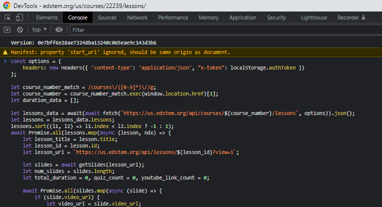

# Ed-Lesson-Durations

## Code snippet that automatically scrapes the duration of each lesson on Ed Lesson

# Instructions

1. Open the base course page in Ed Lessons in Google Chrome (see Note 1)
   
2. Open up the development tools (right click and then select "inspect")
3. Navigate to the "Console" tab
4. Paste the contents of "scrapeDurations.js" into the console
   
5. Press enter to run the code
6. You should see a table printout of each lesson and the corresponding durations. Columns explained below
   

## Column Explanations

1. "Title": The title of the lesson
2. "num_slides": The number of slides in that lesson. Includes all slides types (video, non-video, quiz, etc)
3. "duration (s)": The duration, in seconds
4. "duration": The duration, formatted as "XX minutes XX seconds"
5. "num_quiz": The number of quiz slides in the lesson
6. "YouTube videos (not included in the duration)": The number of slides with a youtube video instead of an Ed Lessons Video. Note: these videos are not included in the total duration

## Notes and Warnings

1. This code has only been tested in Google Chrome
2. This code has only been tested on 2 GT OMSCS courses (the only 2 I have access to). Results may vary with other courses. If you find a problem, open an issue with the problem.

## Found a bug?

Open it up as an issue!
